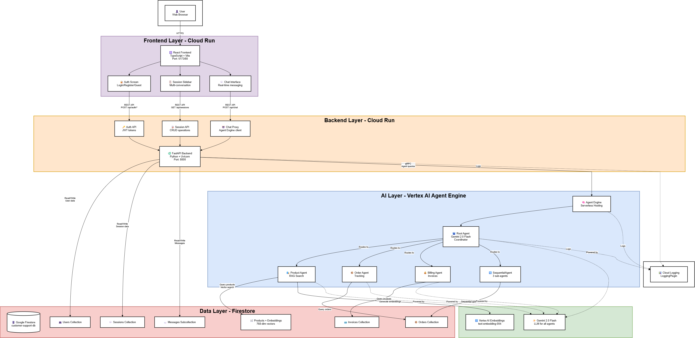

# Multi-Agent Customer Support System

A production-ready customer support system with React frontend and FastAPI backend, built with Google's Agent Development Kit (ADK). Features multi-agent orchestration, RAG semantic search, Memory Bank, and Sequential workflow pattern for validated refund processing.

## Architecture



The system is built on Google Cloud Platform with:
- **Frontend:** React/TypeScript on Cloud Run
- **Backend:** FastAPI + Cloud Proxy on Cloud Run
- **AI Layer:** Vertex AI Agent Engine with multi-agent orchestration
- **Data Layer:** Firestore with vector search, Memory Bank for cross-session memory

For detailed architecture documentation, see [ARCHITECTURE.md](./docs/ARCHITECTURE.md).

## Key Features

- 🤖 **Multi-Agent System** - Root agent coordinates specialized agents (Product, Order, Billing)
- 🧠 **Memory Bank** - Remembers user preferences across sessions
- 🔍 **RAG Semantic Search** - Vector embeddings for intelligent product search
- ⚡ **Sequential Workflow** - SequentialAgent for validated refund processing with step-by-step validation gates
- 👥 **User Management** - Email/password auth or guest access
- 💬 **Multi-Session Conversations** - Multiple chat threads per user
- 🔄 **Retry Logic** - Automatic exponential backoff for transient errors
- 🧪 **Comprehensive Testing** - Pytest automation with ADK AgentEvaluator
- 🎤 **Voice Features** - Speech-to-text input and text-to-speech output
- ☁️ **Cloud Deployment** - Deploy to Cloud Run + Vertex AI Agent Engine

## Quick Start

> 📖 **New to the project?** See **[GETTING_STARTED.md](./GETTING_STARTED.md)** for a complete step-by-step setup checklist.

### Prerequisites

Before deploying, you need:
- **Python 3.11** (managed with pyenv)
- **GCP project** with billing enabled
- **Required APIs** enabled (Vertex AI, Firestore, Cloud Run, etc.)
- **IAM permissions** configured
- **GCS bucket** for staging

**Install Python 3.11 with pyenv:**
```bash
# Install pyenv (macOS)
brew install pyenv

# Install pyenv (Linux)
curl https://pyenv.run | bash

# Install Python 3.11.13
pyenv install 3.11.13

# The project uses .python-version file
cd customer-support-mas
python --version  # Should show 3.11.13
```

**Run automated GCP setup:**
```bash
# 1. Authenticate with GCP
gcloud auth login
gcloud auth application-default login

# 2. Set your project
gcloud config set project YOUR_PROJECT_ID

# 3. Run setup scripts
./scripts/setup_gcp.sh        # Enable APIs, create service account, grant IAM roles
./scripts/setup_firestore.sh  # Create Firestore database, seed data
```

See **[PREREQUISITES.md](./docs/PREREQUISITES.md)** for detailed setup instructions.

### Deploy the System

```bash
# 1. Configure environment variables
cp .env.example .env
nano .env  # Edit with your GCP project details

# 2. Deploy agent to Vertex AI Agent Engine
python deployment/deploy.py  # Run from project root

# 3. Deploy frontend + backend to Cloud Run
./deployment/deploy-cloudrun.sh

# 4. Access the web application
open https://customer-support-ai-xxxxx-uc.a.run.app
```

## Project Structure

```
customer-support-mas/
├── customer_support_agent/       # Core agent system
│   ├── main.py                   # Entry point
│   ├── config.py                 # Agent configurations
│   ├── agents/                   # Agent definitions
│   │   ├── root_agent.py         # Root coordinator (Gemini 2.5 Pro)
│   │   ├── product_agent.py      # Product specialist (Gemini 2.0 Flash)
│   │   ├── order_agent.py        # Order specialist
│   │   ├── billing_agent.py      # Billing specialist
│   │   ├── workflow_agents.py    # Parallel/Sequential/Loop agents
│   │   └── callbacks.py          # Memory Bank callbacks
│   ├── tools/                    # Tool implementations
│   │   ├── product_tools.py      # 6 product tools (including get_product_info smart wrapper)
│   │   ├── order_tools.py        # 3 order tools
│   │   ├── billing_tools.py      # 6 billing tools
│   │   └── workflow_tools.py     # Loop control tools
│   ├── database/                 # Database layer
│   │   ├── client.py             # Firestore client
│   │   └── seed.py               # Database seeding
│   └── services/                 # Business logic
│       └── rag_search.py         # RAG semantic search
├── backend/                      # FastAPI backend
│   └── app/
│       ├── main.py               # API server
│       ├── auth.py               # User authentication
│       ├── agent_client.py       # Agent Engine client
│       └── database.py           # Firestore operations
├── frontend/                     # React frontend
│   └── src/
│       ├── App.tsx               # Main component
│       ├── components/           # UI components
│       └── services/             # API clients
├── deployment/                   # Deployment scripts
│   ├── deploy.py                 # Deploy to Agent Engine
│   └── deploy-cloudrun.sh        # Deploy to Cloud Run
├── scripts/                      # Utility scripts
│   └── add_embeddings.py         # Add vector embeddings for RAG
├── tests/                        # Test suite
│   ├── test_customer_support.py  # Main test suite
│   ├── unit/                     # Unit tests
│   └── integration/              # Integration tests
├── online_evaluation/            # Online evaluation scripts
│   ├── run_agent_evaluation.py   # Batch evaluation
│   └── run_single_eval.py        # Single test case
└── docs/                         # Documentation
    ├── ARCHITECTURE.md           # System architecture
    └── DEPLOYMENT.md             # Deployment guide
```

## Technology Stack

**Frontend**: React 18, TypeScript, Vite
**Backend**: FastAPI, Python 3.11 (pinned with pyenv), Uvicorn
**AI/ML**: Google ADK, Gemini 2.5 Pro, Gemini 2.0 Flash, Vertex AI Embeddings
**Database**: Firestore (vector search + NoSQL)
**Infrastructure**: Cloud Run, Vertex AI Agent Engine, Docker

## Agent Architecture

### 1. Root Agent (Coordinator)
- **Model**: Gemini 2.5 Pro
- **Role**: Routes requests to specialist agents
- **Tools**: 4 AgentTools (product_agent, order_agent, billing_agent, refund_workflow)

### 2. Product Agent
- **Model**: Gemini 2.5 Pro
- **Tools**:
  - `search_products` - RAG semantic search
  - **`get_product_info`** - **Smart unified tool (default)** - Fetches details + inventory + reviews comprehensively
  - `get_last_mentioned_product` - Context-aware retrieval
  - `get_all_saved_products_info` - Efficient multi-product fetch from last search
  - `get_product_details` - Fetch only details (for "ONLY details" requests)
  - `check_inventory` - Stock levels only (for "ONLY inventory" requests)
  - `get_product_reviews` - Customer reviews only (for "ONLY reviews" requests)

**Design Philosophy**: The product agent defaults to providing comprehensive information (`get_product_info`) for better UX. Individual tools are only used when users explicitly request specific data with "ONLY" or "JUST" keywords.

### 3. Order Agent
- **Model**: Gemini 2.0 Flash
- **Tools**: `track_order`, `get_my_order_history`

### 4. Billing Agent
- **Model**: Gemini 2.0 Flash
- **Tools**: `get_invoice`, `get_invoice_by_order_id`, `check_payment_status`
- **Note**: Refunds are processed through the dedicated `refund_workflow` for proper validation

## Workflow Patterns

### Smart Tool Wrapper
```python
# The product agent uses get_product_info() by default
# Fetches details + inventory + reviews comprehensively
# Deterministic behavior - no keyword-based routing
```

### SequentialAgent - Stepwise Validation
```python
# Use case: "I want a refund for order ORD-12345"
# Steps: Validate Order → Check Eligibility → Process Refund
# Each step must pass before proceeding
# Only way to process refunds - ensures proper validation
```

### Efficient Multi-Product Fetch
```python
# Use case: "Show me details on all of them" (after search)
# Uses get_all_saved_products_info - single call for all products
# Replaces iterative LoopAgent approach to avoid timeouts
```

## Testing

```bash
# Run full test suite
pytest tests/ -v

# Run specific test category
pytest tests/test_customer_support.py::TestUnitEvaluation -v

# Run integration tests
pytest tests/test_customer_support.py::TestIntegrationEvaluation -v

# Verify refactoring
python test_refactoring.py
```

## RAG Search

RAG (Retrieval Augmented Generation) enables semantic search:

```python
# User: "gaming computer"
# 1. Embed query with text-embedding-004 (768-dim vector)
# 2. Search Firestore vector index
# 3. Return top 5 semantic matches (finds "ROG Gaming Laptop")
# 4. Apply price/category filters
```

**Setup RAG:**
```bash
# 1. Create vector index (via REST API or script)
python scripts/create_vector_index.py

# 2. Wait for index status = READY (5-10 min)
gcloud firestore indexes composite list --database=customer-support-db

# 3. Add embeddings to products
python scripts/add_embeddings.py \
  --project YOUR_PROJECT \
  --database customer-support-db \
  --location us-central1

# 4. Redeploy agent
python deployment/deploy.py --action deploy
```

**Fallback**: If RAG unavailable, uses keyword search automatically.

## Memory Bank

Remembers user preferences across sessions:

```python
# Extractions:
# - "Customer prefers products under $500"
# - "User had delivery issues with order ORD-12345"
# - "Customer is interested in gaming laptops"
```

Agents use `PreloadMemoryTool` to load memories at conversation start.

## Configuration

### Using .env Files (Recommended)

```bash
# 1. Copy example files
cp .env.example .env
cp backend/.env.example backend/.env

# 2. Edit .env with your values
GOOGLE_CLOUD_PROJECT=your-project-id
GOOGLE_CLOUD_LOCATION=us-central1
GOOGLE_CLOUD_STORAGE_BUCKET=your-bucket-name
AGENT_ENGINE_RESOURCE_NAME=projects/.../reasoningEngines/...
```

The system automatically loads .env files:
- **Root `.env`** - Used by deployment scripts and agent code
- **`backend/.env`** - Used by FastAPI backend (pydantic-settings)
- **`frontend/.env`** - Used by React frontend (Vite)

### Environment Variables

**Required:**
- `GOOGLE_CLOUD_PROJECT` - Your GCP project ID
- `GOOGLE_CLOUD_STORAGE_BUCKET` - GCS bucket for staging (with `gs://` prefix)
- `AGENT_ENGINE_RESOURCE_NAME` - Deployed agent resource name

**Optional:**
- `GOOGLE_CLOUD_LOCATION` - GCP region (default: `us-central1`)
- `FIRESTORE_DATABASE` - Firestore database name (default: `(default)`)
- `GOOGLE_GENAI_USE_VERTEXAI` - Use Vertex AI (default: `1`)
- `FRONTEND_URL` - Frontend URL for CORS (default: `http://localhost:3000`)
- `PORT` - Backend port (default: `8000`)

## Database Schema

Firestore collections:

- **users/** - User accounts
- **sessions/** - Conversation sessions
- **messages/** - Chat messages
- **products/** - Products with embeddings (768-dim vectors)
- **orders/** - Customer orders
- **invoices/** - Billing invoices

## Example Interactions

**Product Search:**
```
User: Show me laptops under $600
Agent: [Uses search_products with RAG]
      Returns: UltraBook Pro ($899), ThinkStation ($799), OfficeMax ($599)
```

**Comprehensive Lookup:**
```
User: Tell me everything about PROD-001
Agent: [Uses get_product_info - smart unified tool]
      Returns: Details + Inventory (50 units) + Reviews (4.5/5)
```

**Refund Request (SequentialAgent):**
```
User: I want a refund for order ORD-12345
Agent: [Uses refund_workflow]
      Step 1: Validate order ✓
      Step 2: Check eligibility ✓
      Step 3: Process refund ✓
      Returns: Refund processed successfully
```

## Deployment

### Deploy to Agent Engine

```bash
python deployment/deploy.py
# Returns: projects/.../reasoningEngines/...
```

### Deploy to Cloud Run

```bash
# Set environment variables
export GOOGLE_CLOUD_PROJECT=your-project-id
export AGENT_ENGINE_RESOURCE_NAME=projects/.../reasoningEngines/...

# Deploy
./deployment/deploy-cloudrun.sh

# Access
open https://customer-support-ai-xxxxx-uc.a.run.app
```

## Observability

**Python Logging:**
```python
logging.info(f"[PRODUCT SEARCH] Query: {query}, Found: {len(results)} products")
```

**LoggingPlugin:**
- Automatic request/response logging
- Performance metrics
- Error tracking

**Cloud Logging:**
All logs sent to Google Cloud Logging for monitoring.


## Troubleshooting

See **[TROUBLESHOOTING.md](./docs/TROUBLESHOOTING.md)** for comprehensive error solutions.

**Quick fixes:**

**Import Error:**
```bash
# Always run from project root
cd /path/to/customer-support-mas
python deployment/deploy.py
```

**API Not Enabled:**
```bash
./scripts/setup_gcp.sh  # Enables all required APIs
```

**Permission Denied:**
```bash
./scripts/setup_gcp.sh  # Configures IAM roles
```

**Check Logs:**
```bash
gcloud run services logs read customer-support-ai --limit=50
```

## Documentation

- **[GETTING_STARTED.md](./GETTING_STARTED.md)** - 📋 Complete setup checklist (START HERE)
- **[DEPLOYMENT_NOTES.md](./DEPLOYMENT_NOTES.md)** - 📌 Current deployment status & known issues
- **[PYTHON_SETUP.md](./docs/PYTHON_SETUP.md)** - 🐍 Python 3.11 + pyenv installation guide
- **[PREREQUISITES.md](./docs/PREREQUISITES.md)** - ⚙️ Required APIs, IAM roles, GCP setup
- **[ENV_SETUP.md](./docs/ENV_SETUP.md)** - 🔧 Environment configuration with .env files
- **[DEPLOYMENT.md](./docs/DEPLOYMENT.md)** - 🚀 Deploy to Cloud Run & Vertex AI Agent Engine
- **[ARCHITECTURE.md](./docs/ARCHITECTURE.md)** - 🏗️ System design, multi-agent workflows, RAG search
- **[TROUBLESHOOTING.md](./docs/TROUBLESHOOTING.md)** - 🔧 Common errors and solutions

## Resources

- [Google ADK Documentation](https://cloud.google.com/vertex-ai/docs/agent-builder)
- [Vertex AI Agent Engine](https://cloud.google.com/vertex-ai/docs/reasoning-engine)
- [Firestore Vector Search](https://cloud.google.com/firestore/docs/vector-search)

## Command Reference

```bash
# Setup & Prerequisites
./scripts/setup_gcp.sh                            # Enable APIs, configure IAM
./scripts/setup_firestore.sh                      # Create database, seed data
cp .env.example .env                              # Setup environment config

# Database
python -m customer_support_agent.database.seed    # Seed database
python scripts/add_embeddings.py                  # Add RAG embeddings

# Deployment (run from project root)
python deployment/deploy.py --action deploy       # Deploy to Agent Engine
python scripts/create_vector_index.py             # Create RAG vector index
python scripts/add_embeddings.py --project YOUR_PROJECT --database YOUR_DB  # Add embeddings
./deployment/deploy-cloudrun.sh                   # Deploy to Cloud Run

# Testing
pytest tests/ -v                                  # Run all tests
python test_refactoring.py                        # Verify refactoring

# Management
gcloud ai reasoning-engines list                  # List deployed agents
gcloud run services list                          # List Cloud Run services
gcloud services list --enabled                    # List enabled APIs
```

## License

MIT License - See LICENSE file for details
