# System Architecture

Multi-agent customer support system with RAG, Memory Bank, and sequential workflow pattern for validated refund processing.

## Architecture Diagrams

📊 **Mermaid Diagrams Available:** Interactive architecture diagrams are available in [`docs/diagrams/`](./diagrams/). GitHub renders these automatically. See [`docs/diagrams/README.md`](./diagrams/README.md) for full details.

## Overview

The system consists of multiple layers:
- **Frontend Layer** - React/TypeScript UI on Cloud Run
- **Backend Layer** - FastAPI + Cloud Proxy on Cloud Run
- **AI Layer** - Vertex AI Agent Engine with multi-agent system
- **Data Layer** - Firestore for products, orders, sessions, and Memory Bank

## System Overview

```mermaid
graph TB
    subgraph "User Layer"
        User[👤 User]
    end

    subgraph "Vertex AI Agent Engine Runtime"
        subgraph "Root Coordinator"
            RootAgent[🤖 Root Agent<br/>Model: Gemini 2.5 Pro<br/>Callback: auto_save_to_memory_sdk]
        end

        subgraph "Specialist Agents"
            ProductAgent[🛍️ Product Agent<br/>Model: Gemini 2.5 Flash<br/>+ PreloadMemoryTool<br/>Callback: auto_save_to_memory_sdk]
            OrderAgent[📦 Order Agent<br/>Model: Gemini 2.5 Flash<br/>+ PreloadMemoryTool<br/>Callback: auto_save_to_memory_sdk]
            BillingAgent[💳 Billing Agent<br/>Model: Gemini 2.5 Flash<br/>+ PreloadMemoryTool<br/>Callback: auto_save_to_memory_sdk]
        end

        subgraph "Workflow Patterns"
            RefundWorkflow[🔄 Sequential Workflow<br/>Model: Gemini 2.5 Pro<br/>3-Step Validation]
        end
    end

    subgraph "Memory Bank"
        MemoryService[💾 Memory Bank Service<br/>Generation: Gemini 2.5 Flash<br/>Embedding: text-embedding-004]
        MemoryStore[(Memory Store<br/>USER_PREFERENCES)]
    end

    subgraph "Google Cloud Services"
        Firestore[(🔥 Firestore<br/>Products, Orders, Sessions<br/>Vector Search)]
    end

    User -->|Query| RootAgent
    RootAgent -->|Route| ProductAgent
    RootAgent -->|Route| OrderAgent
    RootAgent -->|Route| BillingAgent
    RootAgent -->|Route| RefundWorkflow

    ProductAgent -->|RAG Search| Firestore
    OrderAgent -->|Fetch Orders| Firestore
    BillingAgent -->|Fetch Invoices| Firestore

    RootAgent -.->|Save Session| MemoryService
    ProductAgent -.->|Save Session| MemoryService
    OrderAgent -.->|Save Session| MemoryService
    BillingAgent -.->|Save Session| MemoryService

    MemoryService -->|Store| MemoryStore
    ProductAgent -->|Load Memories| MemoryStore

    style User fill:#4285F4,stroke:#1967D2,color:#fff
    style RootAgent fill:#34A853,stroke:#0D652D,color:#fff
    style ProductAgent fill:#FBBC04,stroke:#F29900,color:#000
    style OrderAgent fill:#FBBC04,stroke:#F29900,color:#000
    style BillingAgent fill:#FBBC04,stroke:#F29900,color:#000
    style RefundWorkflow fill:#EA4335,stroke:#C5221F,color:#fff
    style MemoryService fill:#9334E6,stroke:#7627BB,color:#fff
    style MemoryStore fill:#9334E6,stroke:#7627BB,color:#fff
    style Firestore fill:#FF6F00,stroke:#E65100,color:#fff
```



📄 **Full Diagram:** [`docs/diagrams/system-overview.mmd`](./diagrams/system-overview.mmd)

This diagram shows the complete flow from user queries through the Root Agent coordinator to specialist agents, with Memory Bank integration and data sources.

## Agent System


📄 **Full Diagram:** [`docs/diagrams/agent-hierarchy.mmd`](./diagrams/agent-hierarchy.mmd)

The multi-agent hierarchy shows the Root Agent coordinator routing to specialist agents (Product, Order, Billing) and the Sequential Refund Workflow.

### 1. Root Agent (Coordinator)

```mermaid
graph TB
    subgraph "Root Agent"
        Agent[🎯 Root Agent<br/>Model: Gemini 2.5 Pro<br/>Coordinator & Router<br/>Callback: auto_save_to_memory_sdk]
        ErrorHandling[⚠️ ERROR HANDLING<br/>Always respond to user<br/>Graceful fallbacks]
    end

    subgraph "Sub-Agents"
        Product[🛍️ Product Agent]
        Order[📦 Order Agent]
        Billing[💳 Billing Agent]
        Refund[🔄 Refund Workflow]
    end

    User[👤 User Query] --> Agent
    Agent -->|Products| Product
    Agent -->|Orders| Order
    Agent -->|Billing| Billing
    Agent -->|Refunds| Refund

    style User fill:#4285F4,stroke:#1967D2,color:#fff
    style Agent fill:#34A853,stroke:#0D652D,color:#fff,stroke-width:3px
    style ErrorHandling fill:#EA4335,stroke:#C5221F,color:#fff
    style Product fill:#FBBC04,stroke:#F29900,color:#000
    style Order fill:#FBBC04,stroke:#F29900,color:#000
    style Billing fill:#FBBC04,stroke:#F29900,color:#000
    style Refund fill:#EA4335,stroke:#C5221F,color:#fff
```



📄 **Full Diagram:** [`docs/diagrams/root-agent.mmd`](./diagrams/root-agent.mmd)

**Role:** Routes requests to specialist agents

**Model:** Gemini 2.5 Pro

**Callback:** `auto_save_to_memory_sdk` - Saves full conversation to Memory Bank

**Tools:**
- product_agent (AgentTool)
- order_agent (AgentTool)
- billing_agent (AgentTool)
- refund_workflow (AgentTool)

**Routing Logic:**
```python
# customer_support_agent/agents/root_agent.py

Products → product_agent
Orders → order_agent
Billing → billing_agent
Refunds → refund_workflow
```

### 2. Product Agent (Specialist)


📄 **Full Diagram:** [`docs/diagrams/product-agent.mmd`](./diagrams/product-agent.mmd)

**Role:** Handles product search, details, inventory, reviews

**Model:** Gemini 2.5 Flash

**Tools:**
- `PreloadMemoryTool` - Loads user memories at session start (budget preferences, product interests)
- `search_products` - RAG semantic search with Firestore vector search
- **`get_product_info`** - **Smart unified tool (DEFAULT)** - Fetches details + inventory + reviews comprehensively
- `get_all_saved_products_info` - Efficient multi-product fetch (replaces LoopAgent to avoid timeouts)
- `get_last_mentioned_product` - Context-aware retrieval from session state
- `get_product_details` - Fetch only details (for explicit "ONLY details" requests)
- `check_inventory` - Stock levels only (for explicit "ONLY inventory" requests)
- `get_product_reviews` - Customer reviews only (for explicit "ONLY reviews" requests)

**Callback:** `auto_save_to_memory` - Saves conversations to Memory Bank

**Features:**
- **Memory-aware responses** - Explicitly acknowledges remembered budget preferences
- **Smart default behavior** - Comprehensive info by default, specific only when requested
- **Session state management** - Tracks last search, product IDs for follow-ups
- **Efficient multi-product handling** - Single call instead of iteration

**File:** `customer_support_agent/agents/product_agent.py`

### 3. Order Agent (Specialist)


📄 **Full Diagram:** [`docs/diagrams/order-agent.mmd`](./diagrams/order-agent.mmd)

**Role:** Order tracking and history

**Model:** Gemini 2.5 Flash

**Tools:**
- `PreloadMemoryTool` - Loads user memories at session start
- `track_order` - Track by order ID
- `get_my_order_history` - Authenticated user's orders

**Callback:** `auto_save_to_memory_sdk` - Saves conversations to Memory Bank

**Features:**
- Automatic user authentication
- Memory-aware (past delivery issues)

**File:** `customer_support_agent/agents/order_agent.py`

### 4. Billing Agent (Specialist)

```mermaid
graph TB
    subgraph "Billing Agent"
        Agent[💳 Billing Agent<br/>Model: Gemini 2.5 Flash<br/>Callback: auto_save_to_memory_sdk]
        Note[⚠️ NOTE: Refunds processed<br/>via refund_workflow only]
    end

    subgraph "Tools"
        T0[PreloadMemoryTool<br/>Load user memories]
        T1[get_invoice<br/>Get by invoice ID]
        T2[get_invoice_by_order_id<br/>Get by order ID]
        T3[check_payment_status<br/>Payment status check]
    end

    subgraph "Data Sources"
        Firestore[(Firestore<br/>Invoices/Payments)]
        Memory[(Memory Bank)]
    end

    Agent --> T0
    Agent --> T1
    Agent --> T2
    Agent --> T3

    T0 --> Memory
    T1 --> Firestore
    T2 --> Firestore
    T3 --> Firestore

    style Agent fill:#FBBC04,stroke:#F29900,color:#000,stroke-width:3px
    style Note fill:#EA4335,stroke:#C5221F,color:#fff
    style T0 fill:#9334E6,stroke:#7627BB,color:#fff
    style T1 fill:#4285F4,stroke:#1967D2,color:#fff
    style T2 fill:#4285F4,stroke:#1967D2,color:#fff
    style T3 fill:#4285F4,stroke:#1967D2,color:#fff
    style Firestore fill:#FF6F00,stroke:#E65100,color:#fff
    style Memory fill:#9334E6,stroke:#7627BB,color:#fff
```



📄 **Full Diagram:** [`docs/diagrams/billing-agent.mmd`](./diagrams/billing-agent.mmd)

**Role:** Invoices, payments, refunds

**Model:** Gemini 2.5 Flash

**Tools:**
- `PreloadMemoryTool` - Loads user memories at session start
- `get_invoice` - Get by invoice ID
- `get_invoice_by_order_id` - Get by order ID
- `check_payment_status` - Payment status

**Note:** Refunds are processed through the dedicated `refund_workflow` (SequentialAgent) for proper validation, not directly through billing_agent.

**Callback:** `auto_save_to_memory_sdk` - Saves conversations to Memory Bank

**File:** `customer_support_agent/agents/billing_agent.py`

## Workflow Patterns

### Smart Tool Wrapper

**Use Case:** Get comprehensive product info by default

**Code:** `customer_support_agent/tools/product_tools.py` - `get_product_info()`

Fetches details + inventory + reviews in one call. Deterministic and simple.

### SequentialAgent - Stepwise Validation

**Use Case:** Refund workflow with validation gates

**Example:** "I want a refund for order ORD-12345"

**Execution:**
```
Step 1: Validate Order
   ↓ (if valid)
Step 2: Check Eligibility
   ↓ (if eligible)
Step 3: Process Refund
   ↓
Success
```

**Benefit:** Each step must pass before proceeding. This is the **only way** to process refunds, ensuring all refunds are properly validated.

**Code:** `customer_support_agent/agents/workflow_agents.py`

### Efficient Multi-Product Fetch

**Use Case:** Get details for multiple products from a previous search

**Example:** "Show me details on all of them" (after seeing search results)

**Tool:** `get_all_saved_products_info`

**Execution:**
```
Single call retrieves all product IDs from session state
Returns comprehensive details for all products
Much faster than iterative approaches
```

**Code:** `customer_support_agent/tools/product_tools.py`

## Memory Bank Integration

### Overview
Memory Bank provides cross-session user memory using Vertex AI's managed service.

### Architecture
```
User Conversation
       ↓
Root Agent (after_agent_callback)
       ↓
auto_save_to_memory()
       ↓
memory_service.add_session_to_memory(session)
       ↓
[Async Background Consolidation by Gemini 2.5 Flash]
       ↓
Memories Stored (USER_PREFERENCES topic)
       ↓
PreloadMemoryTool (in Product Agent)
       ↓
Memories Loaded at Session Start
```

### Components

**1. Callback: `auto_save_to_memory`**
- **File:** `customer_support_agent/agents/callbacks.py`
- **Registered on:** Root Agent, Product Agent, Order Agent, Billing Agent
- **Triggers:** After each agent completes its turn
- **Action:** Sends session to Memory Bank for async consolidation
- **Note:** Consolidation may take several minutes

**2. PreloadMemoryTool**
- **Used by:** Product Agent
- **Purpose:** Automatically loads user memories at session start
- **Memories Retrieved:** Budget preferences, product interests
- **File:** Configured in `product_agent.py` tools list

**3. Memory-Aware Instructions**
- **Location:** `customer_support_agent/agents/product_agent.py` (lines 95-126)
- **Behavior:** Agent explicitly acknowledges remembered preferences
- **Example:**
  - Memory: "User prefers laptops under $600"
  - Response: "I see you previously mentioned a $600 budget for laptops..."

### Configuration
**Deployment:** `deployment/deploy.py`
```python
config={
    "context_spec": {
        "memory_bank_config": {
            "generation_config": {
                "model": "gemini-2.5-flash-001"
            },
            "similarity_search_config": {
                "embedding_model_config": {
                    "model": "text-embedding-004"
                }
            }
        }
    }
}
```

### Memory Topics
- **USER_PREFERENCES** - Budget constraints, product preferences
- Auto-detected by Memory Bank's LLM

## Tools

All tools are organized by domain:

### Product Tools (5 tools)
**File:** `customer_support_agent/tools/product_tools.py`
- search_products
- get_product_details
- get_last_mentioned_product
- check_inventory
- get_product_reviews

### Order Tools (3 tools)
**File:** `customer_support_agent/tools/order_tools.py`
- track_order
- get_order_history
- get_my_order_history

### Billing Tools (6 tools)
**File:** `customer_support_agent/tools/billing_tools.py`
- get_invoice
- get_invoice_by_order_id
- check_payment_status
- validate_order_id (used by refund_workflow)
- check_refund_eligibility (used by refund_workflow)
- process_refund (used by refund_workflow only)

**Note:** `process_refund` is not directly available to billing_agent. All refunds must go through the `refund_workflow` SequentialAgent for proper validation.

## RAG Search

### How It Works

```
User Query: "laptops"
     ↓
Embedding Model (text-embedding-004)
     ↓
768-dim vector
     ↓
Firestore Vector Search
     ↓
Top 5 semantic matches
```

### Setup

1. Seed database: `python -m customer_support_agent.database.seed`
2. Add embeddings: `python scripts/add_embeddings.py`
3. RAG automatically enabled in `search_products`

### Fallback

If RAG unavailable → keyword search

**File:** `customer_support_agent/services/rag_search.py`

## Memory Bank

### Features

- **Cross-session memory** - Remembers user preferences across conversations
- **Automatic extraction** - Pulls key facts from conversations
- **Consolidation** - Creates/updates/deletes memories intelligently

### Examples

Extractions:
- "Customer prefers products under $500"
- "User had delivery issues with order ORD-12345"
- "Customer is interested in gaming laptops"

### Usage

Agents use `PreloadMemoryTool` to load memories at conversation start.

**Callback:** `customer_support_agent/agents/callbacks.py`

## Session State

### How It Works

```python
# Save to state
tool_context.state['last_product_id'] = "PROD-001"

# Retrieve from state
product_id = tool_context.state.get('last_product_id')
```

### Use Cases

- Remember last searched product
- Track products for multi-detail loop
- Maintain conversation context

**Managed by:** ADK ToolContext (automatic persistence)

## Database Schema

### Firestore Collections

```
products/
  ├── id: PROD-001
  ├── name: "UltraBook Pro"
  ├── price: 899.99
  ├── embedding: [768-dim vector]
  └── ...

orders/
  ├── id: ORD-12345
  ├── customer_id: user123
  ├── status: "shipped"
  └── ...

invoices/
  ├── id: INV-2025-001
  ├── order_id: ORD-12345
  └── ...

users/
  ├── id: user123
  ├── email: user@example.com
  └── ...

sessions/
  ├── id: session456
  ├── user_id: user123
  ├── messages: [...]
  └── ...
```

## Observability

### Logging

**Python Logging:**
```python
logging.info(f"[ORDER HISTORY] Found {len(orders)} orders")
```

**LoggingPlugin:**
- Automatic request/response logging
- Performance metrics
- Error tracking

**Cloud Logging:**
All logs sent to Google Cloud Logging for monitoring.

## Request Flow Example

### User: "Show me laptops under $600"

```
1. User → Root Agent
2. Root Agent → Product Agent (routing)
3. Product Agent → search_products tool
   - Checks memory bank for budget preference
   - Runs RAG semantic search
   - Returns 3 products
   - Saves to session state
4. Product Agent → User (formatted response)
```

### User: "Yes, tell me more" (follow-up)

```
1. User → Root Agent
2. Root Agent → Product Agent
3. Product Agent → get_last_mentioned_product tool
   - Retrieves from session state (no ID needed!)
   - Fetches full details
4. Product Agent → User (detailed response)
```

## Code Organization

```
customer_support_agent/
├── main.py                  # Entry point
├── config.py                # Agent configurations
├── agents/
│   ├── root_agent.py        # Coordinator
│   ├── product_agent.py     # Product specialist
│   ├── order_agent.py       # Order specialist
│   ├── billing_agent.py     # Billing specialist
│   ├── workflow_agents.py   # Sequential workflow (refund validation)
│   └── callbacks.py         # Memory callbacks
├── tools/
│   ├── product_tools.py
│   ├── order_tools.py
│   ├── billing_tools.py
│   └── workflow_tools.py
├── database/
│   ├── client.py
│   └── seed.py
└── services/
    └── rag_search.py
```

## Technology Stack

- **Google ADK** - Agent framework
- **Gemini 2.5 Pro** - Root agent model
- **Gemini 2.0 Flash** - Specialist agents
- **Firestore** - NoSQL database + vector search
- **Vertex AI** - Embeddings + Agent Engine
- **FastAPI** - Backend API
- **React** - Frontend UI

## See Also

- [DEPLOYMENT.md](./DEPLOYMENT.md) - Deployment guide
- [README.md](../README.md) - Main documentation
- `customer_support_agent/` - Source code
